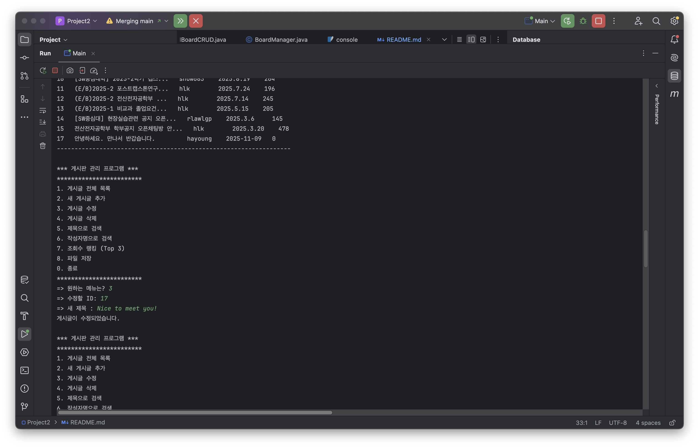
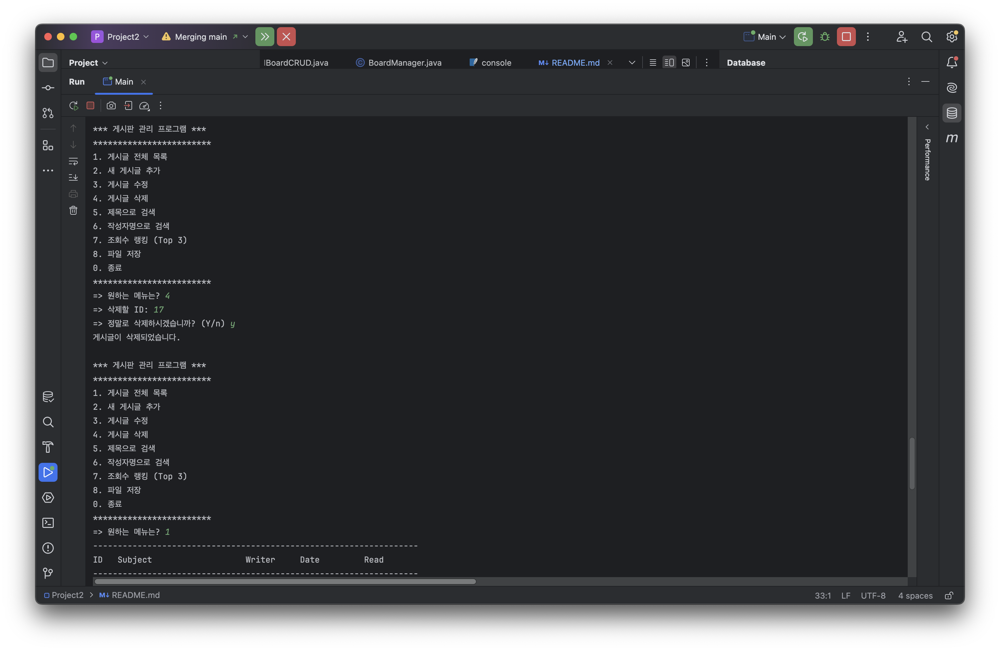
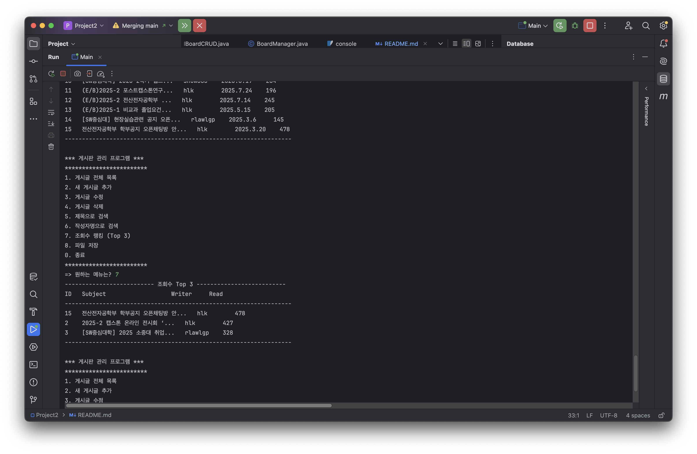

SQLite를 이용한 게시판 관리 프로그램

1. 프로젝트 개요
SQLite 데이터베이스를 이용한 콘솔 게시판 관리 프로그램
게시글을 추가, 조회, 수정, 삭제(CRUD)할 수 있으며, 제목/작성자 검색, 조회수 랭킹, 파일 저장 등의 메뉴와 부가 기능을 제공

2. 주요 기능 및 실행
주요 기능 (총 8개 메뉴)
게시글 전체 목록: DB에 저장된 모든 게시글을 ID 오름차순(오래된 순)으로 출력
새 게시글 추가: 제목(subject), 작성자(writer)를 입력받아 새 게시글 추가
게시글 수정: DB 고유 ID로 게시글을 찾아 제목 수정
게시글 삭제: DB 고유 ID로 게시글을 찾아 확인(Y) 후 삭제
제목으로 검색: 키워드가 포함된 게시글의 제목(subject)을 검색
작성자명으로 검색: 키워드가 포함된 게시글의 작성자(writer)를 검색
조회수 랭킹 (Top 3): 조회수(read)가 높은 상위 3개 게시글 출력
파일 저장: 현재 DB의 모든 데이터를 data_yyyymmdd_hhmm.txt 형식으로 저장
종료: 프로그램 종료 및 DB 연결 해제

실행 방법
Main.java 파일을 실행
프로그램 시작 시 board.db 파일에 자동으로 연결하며, board 테이블이 없을 경우 새로 생성

3. 데이터 항목 (테이블: board)
id: INTEGER (PRIMARY KEY AUTOINCREMENT, 게시글 고유 ID)
subject: TEXT (게시글 제목)
writer: TEXT (작성자명)
created_date: TEXT (필수 항목, 생성일)
updated_date: TEXT (수정일)
read: INTEGER (조회수)

4. 예시 실행화면

<small>게시글 전체 목록 실행 화면</small>

<small>게시글 추가(1) 실행 화면</small>

<small>게시글 추가(2) 실행 화면</small>

<small>제목 검색 실행 화면</small>

<small>게시글 수정 실행 화면</small>

<small>게시글 삭제 실행 화면</small>

<small>게시글 삭제 실행 화면</small>

<small>조회수 랭킹 실행 화면</small>

<small>파일 저장</small>

<small>파일 저장 및 종료 화면</small>

5. 클래스 설명

Main: 프로그램 시작 (BoardManager 실행)
BoardManager: 메인 메뉴(총 8개)를 보여주고 사용자 입력을 받는 클래스
BoardCRUD: IBoardCRUD를 구현. SQLite DB에 연결하고 SQL을 실행하는 핵심 로직 담당.
BoardItem: 게시글 데이터(id, subject, writer...)를 담는 객체. 목록/랭킹 출력 서식(toString(), getHeader())도 담당.
IBoardCRUD: BoardCRUD가 구현해야 할 8개 기능의 메서드를 정의한 인터페이스.

6. 향후 개선 아이디어
출력 포맷 향상